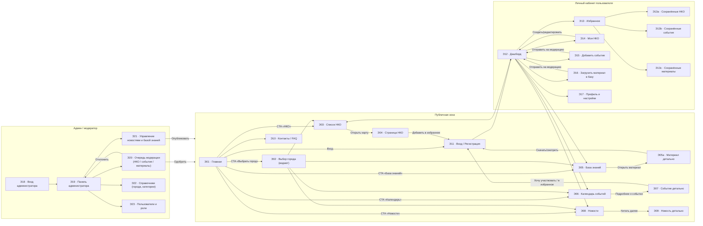
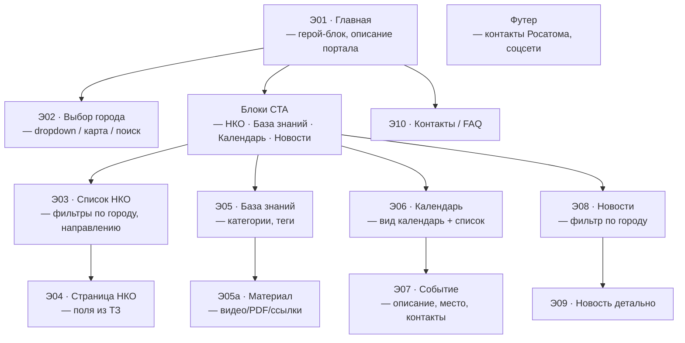
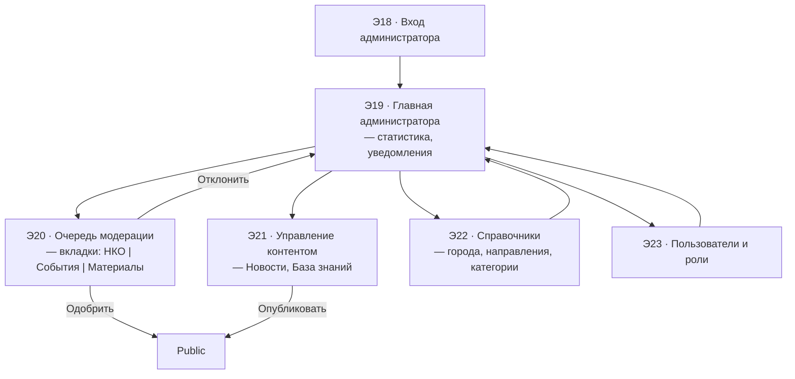
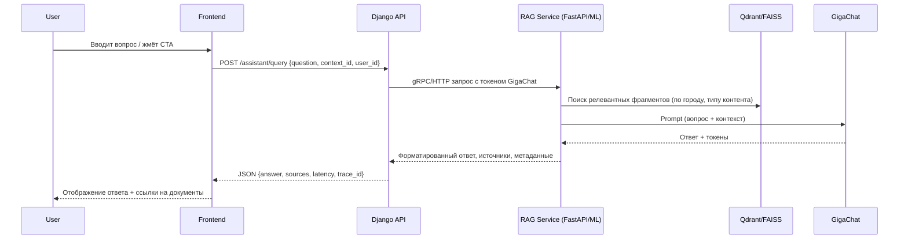

## Архитектурная схема экранов (ТЗ №3 «Добрые дела Росатома»)

Требовалась именно «карта окон»: без дизайна, только перечень экранов и все переходы между ними. Ниже — полный набор схем в формате mermaid, чтобы их можно было сразу вставить в документацию или инструменты визуализации.

---

### 1. Общая карта проекта: все экраны и связи



---

### 2. Публичные экраны: детальная схема переходов



---

### 3. Личный кабинет пользователя / НКО

```mermaid
flowchart LR
    Dashboard["Э12 · Дашборд\n— последние новости, события, рекомендации"]
    Favorites["Э13 · Избранное"]
    SavedNKO["Сохранённые НКО"]
    SavedEvents["Сохранённые события"]
    SavedMaterials["Сохранённые материалы"]
    MyOrg["Э14 · Моя НКО"]
    OrgForm["Форма редактирования НКО"]
    EventForm["Э15 · Добавить событие"]
    MaterialsUpload["Э16 · Добавить материал"]
    Profile["Э17 · Профиль и настройки"]

    Dashboard -->|"Кнопка «Избранное»"| Favorites
    Favorites --> SavedNKO
    Favorites --> SavedEvents
    Favorites --> SavedMaterials

    Dashboard -->|"«Создать / редактировать НКО»"| MyOrg
    MyOrg --> OrgForm
    OrgForm -->|"Отправить (модерация)"| Dashboard

    Dashboard -->|"«Добавить событие»"| EventForm
    EventForm -->|"Сохранить" (→ модерация)| Dashboard

    Dashboard -->|"«Добавить материал»"| MaterialsUpload
    MaterialsUpload -->|"Сохранить» (→ модерация)"| Dashboard

    Dashboard -->|"«Профиль»"| Profile
    Profile -->|"Сохранить"| Dashboard
```

---

### 4. Интерфейс администратора и модерации



---

### Применение схем
- Каждый узел = отдельный экран/окно, как требовалось. Номера можно сохранить для макетов и задач («Э05» = базовый идентификатор).
- Стрелки показывают переходы (кнопки, ссылки, CTA). Подписи добавлены только там, где есть неоднозначность.
- Для нашей «фишки» (RAG-помощник на GigaChat) можно добавить ещё один экран и соединить его с `Landing`, `NKODetail`, `Dashboard`, `AdminHome` без изменения логики остальных блоков.

---

## Интеграция RAG / GigaChat

### Точки входа на фронтенде
- **Плавающая кнопка «Спросить помощника»**: отображается на `Landing`, `NKOList`, `Knowledge`, `Calendar`, `News`, `Dashboard`, `MyOrg`, `AdminHome`.
- **Контекстные CTA**:
  - `Э04 · Страница НКО` → «Спросить про эту НКО».
  - `Э05a · Материал` → «Пояснить материал».
  - `Э07 · Событие` → «Помочь подготовиться».
  - `Э14 · Моя НКО` / `Э15 · Добавить событие` → генерация черновиков описаний.
- **Админка**: подсказки при модерации («Суммаризировать заявку», «Проверить факты»).

### Функциональные сценарии
1. **Справочная помощь пользователю** — вопрос по НКО/событию/материалу с автоматическим подставлением контекста (ID записи, ссылки на источники).
2. **Генерация черновиков** — для НКО/событий/новостей помощник предлагает структуру текста, проверяет соответствие брендбуку.
3. **Админ-модерация** — резюмирование новых заявок, подсказки по критериям проверки.
4. **FAQ/Поиск** — RAG возвращает не только ответ, но и список документов с подсветкой релевантных частей.

### Архитектура потока данных



### Компоненты
- `ml/ingest.py` — загрузка ТЗ, контента сайта, минуток и новостей → нарезка и запись в VectorDB.
- `ml/rag_service.py` — FastAPI-сервис, инкапсулирующий эмбеддинги, поиск и вызовы GigaChat.
- `backend/assistant/` — Django app c REST endpoint, авторизацией, хранением истории запросов.
- `frontend/src/features/assistant` — виджет чата + контекстные кнопки.

### Технические заметки
- **Контекст**: используем фильтры по городу/типу контента, чтобы ответы были специфичны.
- **Кэширование**: популярные вопросы (FAQ) кешируются в Redis, но всегда можно запросить RAG для уточнений.
- **Безопасность**: токены GigaChat и сервисные ключи в `.env`, трафик между Backend ↔ RAG только внутри VPC/докер-сети.
- **Трекинг качества**: логируем промпты/ответы (без персональных данных) в `assistant_logs` для дебага и метрик.

Такую схему можно расширить под live-стриминг ответов (Server-Sent Events/WebSocket) или голосовой интерфейс, если останется время.

### Что дальше
1. Сверить список экранов с оригинальным ТЗ ( `docs/tz.txt` ) — если появятся новые требования, добавляем новые узлы.
2. Перенести схемы в Miro/Figma и подписать пользовательские сценарии для каждой аудитории (жители, НКО, модераторы).
3. На базе номеров экранов разбить задачи между фронтом, бэком и ML (например, «Э05 — API каталога материалов»).

